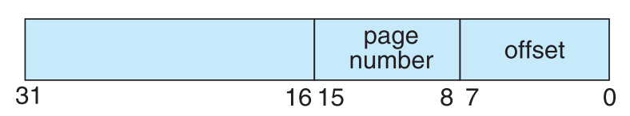
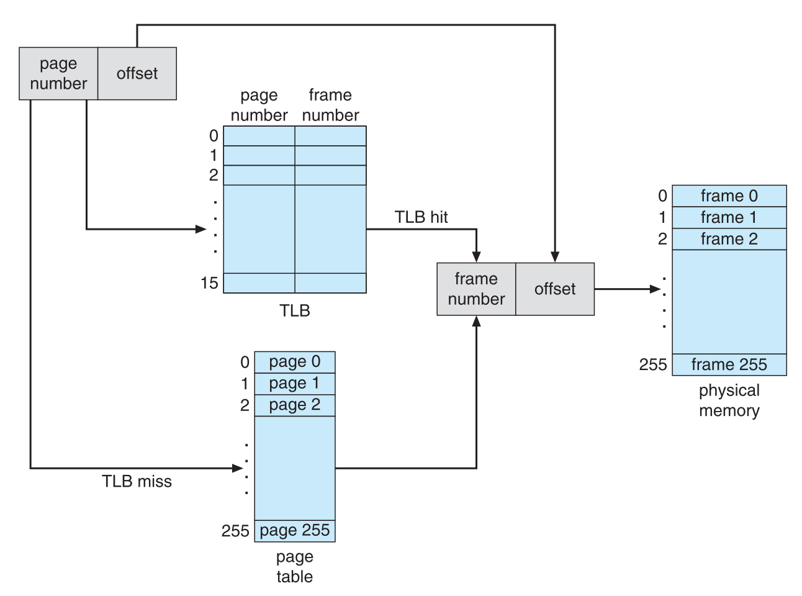

## Design and Implementation of a Virtual Memory Unit (MMU)
**Out:** November 15, 2021, at 09:00am   
**Due:** December 6, 2021, at 09:00pm

This project consists of writing a program that translates logical to physical addresses for a virtual address space of 
size 2<sup>16</sup> = 65,536 bytes. Your program will read from a file containing logical addresses and, using a TLB and a page 
table, translates each logical address to its corresponding physical address and output the value of the byte stored 
at the translated physical address. Your learning goal is to use simulation to understand the steps involved in translating 
logical to physical addresses. This will include resolving page faults using demand paging, managing a TLB, and 
implementing a page-replacement algorithm.

### More Specifications   
Your program will read a file containing several 32-bit integer numbers that represent logical addresses. However, 
you need only be concerned with 16-bit addresses, so you must mask (i.e., ignore) the high-order 16 bits of each logical address. 
The low-order 16 bits are divided into (1) an 8-bit page number and (2) an 8-bit page offset. Hence, the addresses are 
structured as shown as:  

<!--  -->


Other specifics include the following:
* 2<sup>8</sup> entries in the page table 
* Page size of 2<sup>8</sup> bytes 
* 16 entries in the TLB 
* Frame size of 2<sup>8</sup> bytes 
* 256 frames 
* Physical memory of 65,536 bytes (256 frames × 256-byte frame size)    


Additionally, your program need only be concerned with reading logical
addresses and translating them to their corresponding physical addresses. You do not need to support writing to the 
logical address space.

### Phase 1 
#### Address Translation

Your program will translate logical to physical addresses using a TLB and page table as outlined in Section 9.3. First, 
the page number is extracted from the logical address, and the TLB is consulted. In the case of a TLB hit, the frame
number is obtained from the TLB. In the case of a TLB miss, the page table must be consulted. In the latter case, either
the frame number is obtained from the page table, or a page fault occurs. A visual representation of the address-translation 
process is:




#### Handling Page Faults
Your program will implement demand paging as described in Section 10.2. The backing store is represented by the file 
`BACKING_STORE.bin`, a binary file of size 65,536 bytes located in `StartKit` directory. When a page fault occurs, you 
will read in a 256-byte page from 
the file BACKING STORE and store it in an available page frame in physical memory. For example, if a logical address with 
page number 15 resulted in a page fault, your program would read in page 15 from BACKING STORE (remember that pages 
begin at 0 and are 256 bytes in size) and store it in a page frame in physical memory. Once this frame is stored (and 
the page table and TLB are updated), subsequent accesses to page 15 will be resolved by either the TLB or the page table.

You will need to treat `BACKING_STORE.bin` as a random-access file so that
you can randomly seek to certain positions of the file for reading. We suggest using the standard C library functions 
for performing I/O, including `fopen()`, `fread()`, `fseek()`,and `fclose()`. The size of physical memory is the same as the size
of the virtual address space, i.e., 65,536 bytes, so you do not need to be concerned about page replacements during a page fault at this phase. Later, in phase 2, we describe a modification to this project assuming a smaller amount of physical memory, for which, a  page-replacement strategy will be required.

#### How to Begin
First, write a simple program that extracts the page number and offset based on:


from the following integer numbers: 
```
1, 256, 32768, 32769, 128, 65534, 33153
```

Perhaps the easiest way to do this is by using the operators for bit-masking and bit-shifting. Once you can correctly 
establish the page number and offset from an integer number, you are ready to begin. Initially, we suggest that you 
bypass the TLB and use only a page table. You can integrate the TLB once your page table is working properly. Remember, 
address translation can work without a TLB; the TLB just makes it faster. When you are ready to implement the TLB, 
recall that it has only **16** entries, so you will need to use a replacement strategy when you update a full TLB. 
FIFO policy should be used for updating the TLB.

### Phase 2 
#### Page Replacement
Thus far, this project has assumed that physical memory is the same size as the virtual address space.
In practice however, physical memory is typically much smaller than a virtual address space. This phase of the project now 
assumes using a smaller physical address space with 128 page frames rather than 256. So at this phase, we have at most
2<sup>7</sup> valid entries in the page table (i.e., 128 pages). This change will require modifying 
your program so that it keeps track of free page frames as well as implementing a page-replacement policy using 
LRU (Section 10.4) to resolve page faults when there is no free memory.


### How should Your Project Work
Your program should read in the file `addresses.txt`, 
which contains 1,000 logical addresses ranging from 0 to 65535. 
Your program is to translate each logical address to a physical address and determine the contents of the signed byte 
stored at the correct physical address. (Recall that in the C language, the char data type occupies a byte of storage, so we suggest using char values.)

Your program is to output a comma-separated values (csv) file that has three columns:

* Column 1: the logical address being translated (the integer value being read from `addresses.txt`).
* Column 2: the corresponding physical address (what your program translates the logical address to).
* Column 3: the signed byte value stored in physical memory at the translated physical address.

### Statistics 
After completion, your program is to report the following statistics for both phase 1 and 2 at the end of the `csv` files:
1. Page-fault rate: the percentage of address references that resulted in page faults.
2. TLB hit rate: the percentage of address references that were resolved in the TLB.

Please check the end of file `correct256.csv` to see the correct format for reporting the statistics. 
Since the logical addresses in `addresses.txt` were generated randomly and do not reflect any memory access locality, 
do not expect to have a high TLB hit rate.

### How to Test Your Project
We provided the file `addresses.txt`, which contains integer values representing logical addresses ranging from 0 to 65535 
(the size of the virtual address space). Your program will open this file, read each logical address and translate it to 
its corresponding physical address, and output the value of the signed byte at the physical address. The file `correct256.csv` 
is the correct output for `addresses.txt` for phase 1 of this project. You first need to complete the `Makefile` and then modify/use 
`test.sh` script to test your project. 

### Deliverables
Submit a zip file, `project_mmu.zip`, containing all files that are required to build and run your project, including:

    1) Makefile
    2) All C source or header files
    3) BACKING_STORE.bin
    4) addresses.txt
    5) test.sh
    6) correct128.csv
    7) correct256.csv

Please do not submit object files (*.o) or compiled executables.

### Grading 
The TAs will use `test.sh` bash script to grade your project. As can be seen in this file, we first `make` your project using your submitted `Makefile`. Then for phase 1 we run: 

    ./mmu 256 BACKING_STORE.bin addresses.txt

in which, your executable, i.e.,__mmu__, will be given 3 parameters: 256 as the size of the physical memory, `BACKING_STORE.bin` and `addresses.txt`, which contains the logical input addresses. At this phase, your program should create a file called  `output256.csv`, which will be compared against the `correct256.csv`. 

For phase 2, we change the size of the physical memory to 128 by running:

    ./mmu 128 BACKING_STORE.bin addresses.txt
 
 Here, your program should create a file called `output128.csv`. 

__Note__: The grading has been automated using the file `test.sh`, so even having one incorrect line in the `csv` files will result in 0. For statistics, you should set the floating point precision to 2. 


| Item           | Point   | 
| :------------- |:-------------:|
| Correct `output256.csv` file for no page replacement       | 6 |  
| Correct statistics for no page replacement (1 point for TLB-hit rate and 1 point for page-fault rate)                 | 2 |   
| Correct `output128.csv` file for page replacement          | 9 |
| Correct statistics for page replacement (1.5 points for TLB-hit rate and 1.5 points for page-fault rate)                   | 3 |
| **Sum** | **20** |